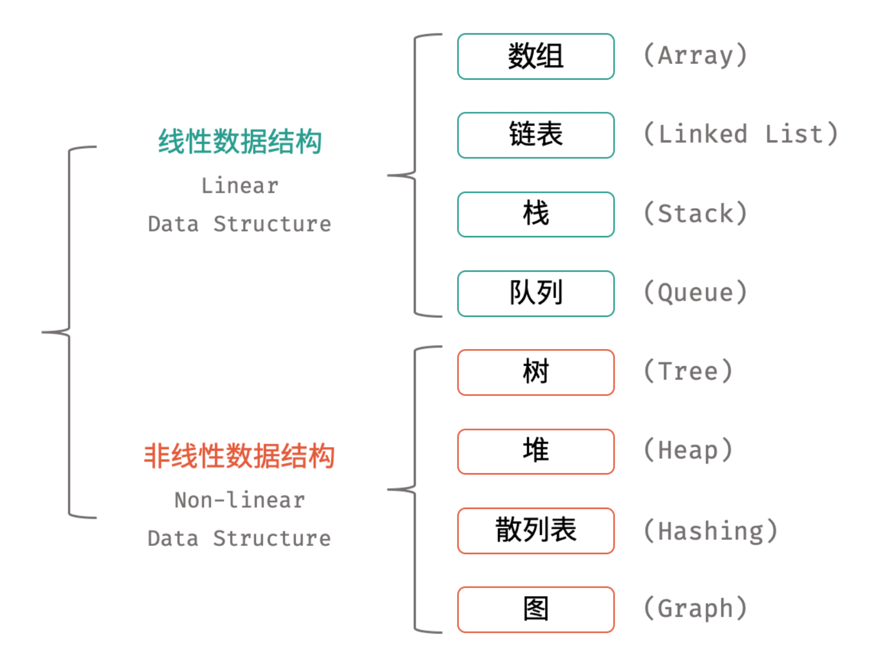
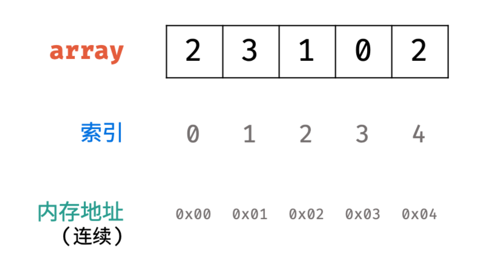
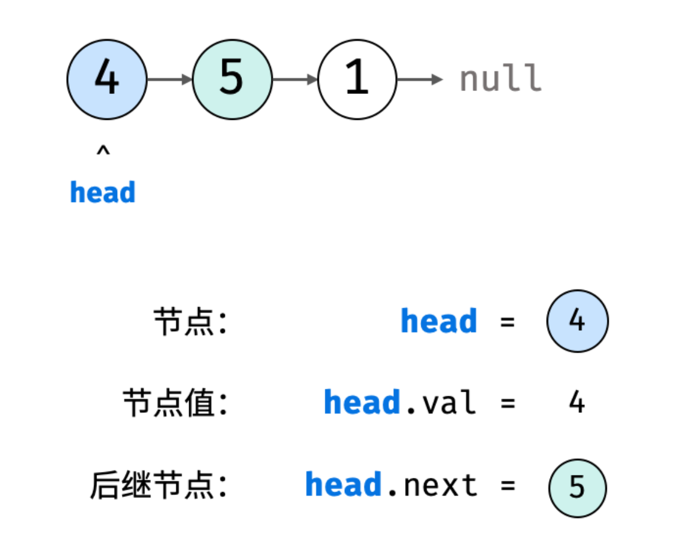

[toc]

# 前言

-   数据结构是为实现对计算机数据有效使用的各种数据组织形式，服务于各类计算机操作。不同的数据结构具有各自对应的适用场景，旨在**降低各种算法计算的时间与空间复杂度，达到最佳的任务执行效率**。

-   如下图所示，常见的数据结构可分为「线性数据结构」与「非线性数据结构」，具体为：「数组」、「链表」、「栈」、「队列」、「树」、「图」、「散列表」、「堆」。

    




-   根据输入数据的特点，时间复杂度具有「最差」、「平均」、「最佳」三种情况，分别使用 O , Θ , Ω 三种符号表示

-   根据从小到大排列，常见的算法时间复杂度主要有：

-   -   O(1) < O(log N) < O(N) < O(N log N) < O(N^2) < O(2^N) < O(N!)


---


# 数组


-   数组是将**相同类型**的元素存储于**连续内存空间**的数据结构，其**长度不可变**。
-   构建此数组需要**在初始化时给定长度**，并对数组每个索引元素赋值

```java
// 初始化一个长度为 5 的数组 array
int[] array = new int[5];
// 元素赋值
array[0] = 2;
array[1] = 3;
array[2] = 1;
array[3] = 0;
array[4] = 2;

// 直接赋值
int[] array = {2, 3, 1, 0, 2};
```





-   **「可变数组」**是经常使用的数据结构，其基于数组和扩容机制实现，相比普通数组更加灵活。常用操作有：访问元素、添加元素、删除元素。

```java
// 初始化可变数组
List<Integer> array = new ArrayList<>();

// 向尾部添加元素
array.add(2);
array.add(3);
array.add(1);
array.add(0);
array.add(2);
```


---


# 链表


-   链表以节点为单位，每个元素都是一个独立对象，在内存空间的存储是**非连续**的。
-   链表的节点对象具有两个成员变量：「值 `val`」，「后继节点引用 `next`」 。
-   如下图所示，建立此链表需要实例化每个节点，并构建各节点的引用指向。

```java
class ListNode {
    int val;       // 节点值
    ListNode next; // 后继节点引用
    ListNode(int x) { val = x; }
}

// 实例化节点
ListNode n1 = new ListNode(4); // 节点 head
ListNode n2 = new ListNode(5);
ListNode n3 = new ListNode(1);

// 构建引用指向
n1.next = n2;
n2.next = n3;

```





---


# 栈


-   栈是一种具有 「先入后出」 特点的抽象数据结构，可使用数组或链表实现。


